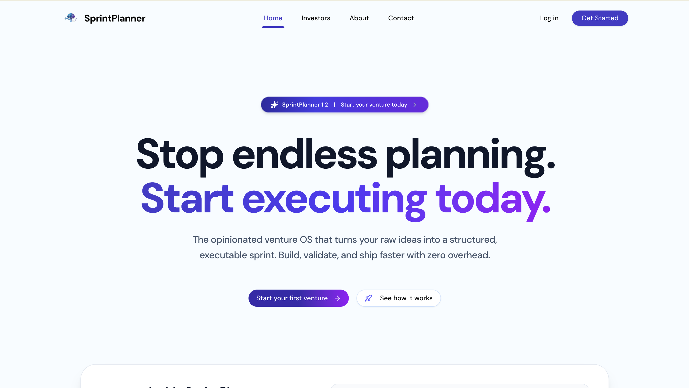
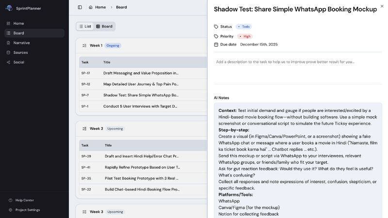
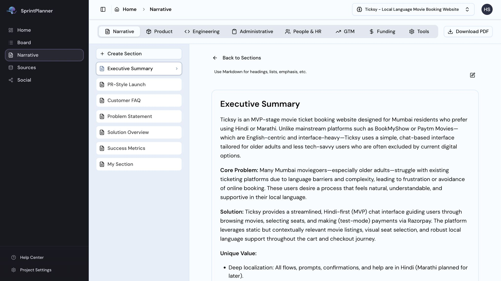
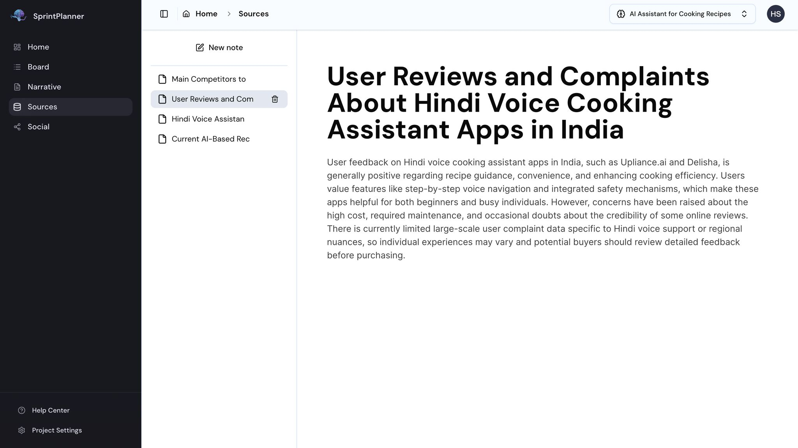

# 🚀 SprintPlanner AI

### Clarity and Progress begin with a simple todo list.

**SprintPlanner AI** is the intelligent backend engine powering SprintPlanner — an AI-powered execution system for founders. It converts raw ideas into structured 4-week sprint plans using multi-agent orchestration, grounded in customer-first thinking, startup best practices, and real execution velocity.



---

## 🧠 Why SprintPlanner Exists

Most founders don't fail because of lack of ideas. They fail because of:

- No structured execution plan
- No validation framework
- No sprint accountability
- Overbuilding too early
- No clear metrics

**SprintPlanner fixes this.**

It helps founders move from:

> **Idea → Structured Plan → Weekly Execution → Measurable Progress**

---

## 🎯 Who It's For

- Early-stage founders
- Solo builders
- Indie hackers
- Venture studio teams
- Startup operators validating new products
- Technical builders who need GTM clarity
- Non-technical founders who need structured execution

---

## 🔥 Core Philosophy

SprintPlanner AI is built on principles from:

- Customer-first validation
- Minimum Viable Offer (MVO)
- Shadow testing
- Value-based selling
- Core business dynamics
- Parkinson's Law (time-constrained execution)

It is **not** a task manager. It is an **execution system.**

---

## ⚙️ What SprintPlanner AI Does

### 1️⃣ Converts Ideas into Structured Sprint Plans

**Input:**

```
"I want to build an AI tool for lawyers."
```

**Output:**

- ICP definition
- Problem framing
- Value proposition
- Validation plan
- 4-week sprint roadmap
- Weekly deliverables
- Metrics framework

### 2️⃣ Generates a 4-Week Execution Blueprint

Each sprint includes:

- Clear objectives
- Daily execution tasks
- Validation milestones
- Risk assumptions
- Customer testing steps
- Defined output artefacts



### 3️⃣ Builds Founder Artefacts Automatically

SprintPlanner AI creates:

- 📄 **Narrative memo** (1–2 pages)
- 📊 Metrics snapshot
- 💬 Investor Q&A workspace
- 📌 Sprint execution tracker





### 4️⃣ Keeps You Execution-Focused

It prevents:

- Overbuilding
- Feature creep
- Analysis paralysis
- Vanity metric obsession

---

## 🏗️ System Architecture (High Level)

SprintPlanner AI is built using:

- **Python** (FastAPI / app.py)
- **Multi-agent orchestration engine**
- Structured output schemas
- Modular sprint generation logic
- Persistent sprint state tracking
- Containerised via **Docker**

**Architecture flow:**

```
User Idea Input
        ↓
Problem Structuring Agent
        ↓
ICP & Validation Agent
        ↓
Sprint Planning Engine
        ↓
Artefact Generator
        ↓
Execution Dashboard
```

---

## 📊 What Makes It Different

| Most tools | SprintPlanner AI |
|------------|-----------------|
| Help you manage tasks | Helps you **decide what to build** |
| Track work | **Validate before building** |
| Organize lists | **Focus on traction** |
| Flexible timelines | **Move in 7-day cycles** |
| Plan forever | **Ship faster** |

It's closer to a **startup co-founder** than a project tool.

---

## 🧩 Example Use Case

**Founder inputs:**

> "I want to build a micro-SaaS for restaurant inventory."

**SprintPlanner AI outputs:**

- **ICP:** 10–20 outlet independent restaurant chains
- **Core pain:** Inventory wastage & stock-outs
- **Validation strategy:** 10 interviews in 7 days
- **Offer:** Manual + spreadsheet-based MVP first
- **Sprint 1 goal:** Problem validation
- **Sprint 2 goal:** Paid pilot
- **Sprint 3 goal:** Automation layer
- **Sprint 4 goal:** First paying customers

---

## 📈 Execution Metrics Framework

Each sprint defines:

- Validation metric
- Revenue signal
- Engagement signal
- Retention signal
- Conversion trigger
- Next sprint criteria

---

## 🛠️ Local Development

### Using uv (Recommended)

```bash
git clone https://github.com/Hitesh-s0lanki/sprint-planner-ai.git
cd sprint-planner-ai
uv venv
source .venv/bin/activate
uv add -r requirements.txt
python app.py
```

### Using pip

```bash
git clone https://github.com/Hitesh-s0lanki/sprint-planner-ai.git
cd sprint-planner-ai
python -m venv .venv
source .venv/bin/activate
pip install -r requirements.txt
python app.py
```

### Using Docker

```bash
docker build -t sprint-planner-ai .
docker run -p 8000:8000 --env-file .env sprint-planner-ai
```

Runs on **http://localhost:8000**

---

## 🔐 Environment Variables

Create `.env` (see `.env.example`):

```env
OPENAI_API_KEY=
DATABASE_URL=
```

---

## 🧪 Future Roadmap

- Founder workspace collaboration
- Investor export mode
- Execution analytics dashboard
- Sprint velocity scoring
- Integrated CRM tracking
- YC-style memo generation
- API for venture studios
- Automated weekly review summaries

---

## 🧠 Long-Term Vision

SprintPlanner AI becomes:

> **The operating system for early-stage founders.**

Not just planning. Not just tasks. But **structured, measurable execution.**

---

## 💬 Philosophy

Most founders chase productivity. SprintPlanner AI optimizes for:

- **Clarity**
- **Focus**
- **Validation**
- **Real customer signal**
- **Revenue before complexity**

---

## 🌍 Live Version

*(Coming Soon)*

---

## 🤝 Contributing

Currently private and under active development.

If you're interested in:

- Early access
- Venture studio integrations
- Growth partnerships
- Angel investing

**Reach out.**

---

## 👨‍💻 Built by

**Hitesh**  
Software Engineer & Founder  
Building systems that help founders execute better.

---

## Commit Message Convention

This project follows [Conventional Commits](https://www.conventionalcommits.org/). Commit messages must follow:

```
<type>: <subject>
```

**Types:** `feat` | `fix` | `docs` | `style` | `refactor` | `perf` | `test` | `build` | `ci` | `chore` | `revert`

---

## CI/CD

GitHub Actions run on every push and PR to `main` and `dev`:

1. **Lint** — Ruff / Flake8
2. **Test** — Pytest
3. **Build** — Docker image build

---

## API Reference

See [api.md](api.md) for full endpoint documentation.
